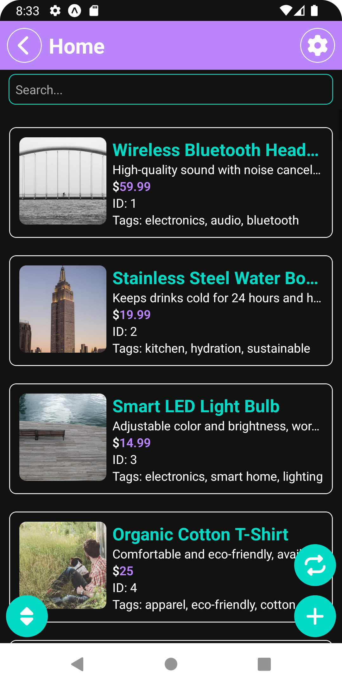
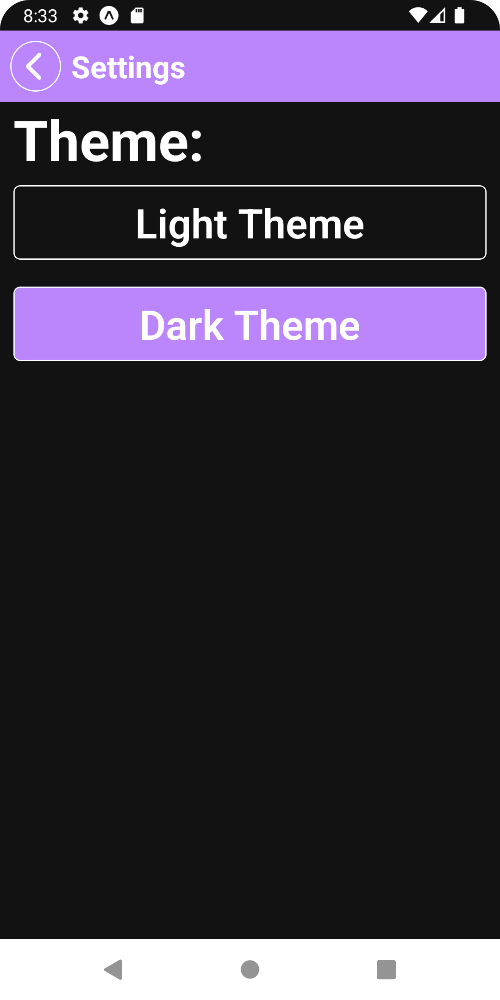
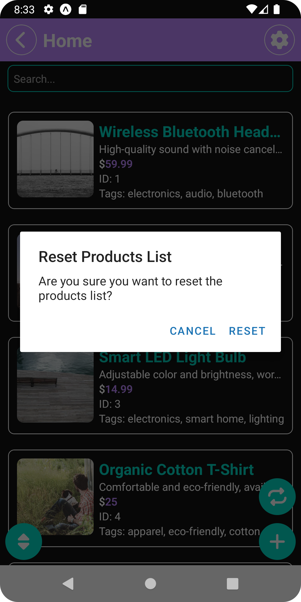
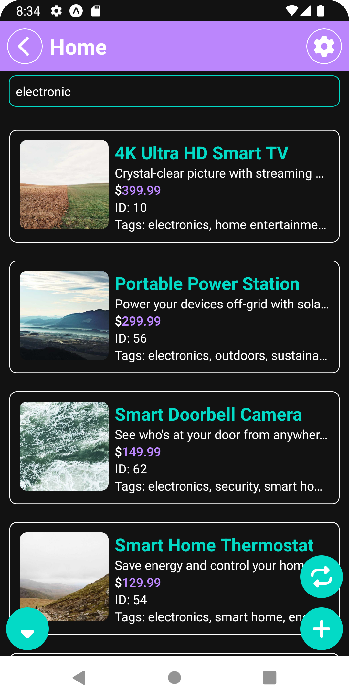
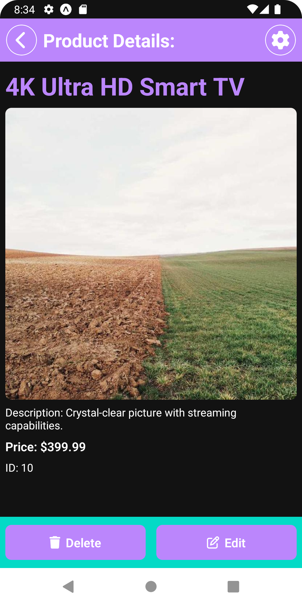
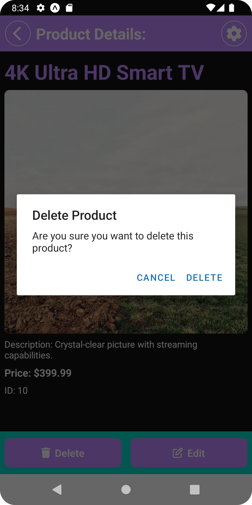
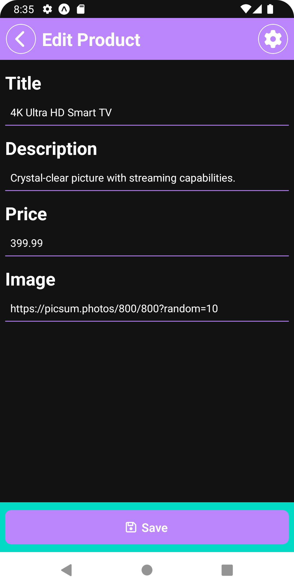
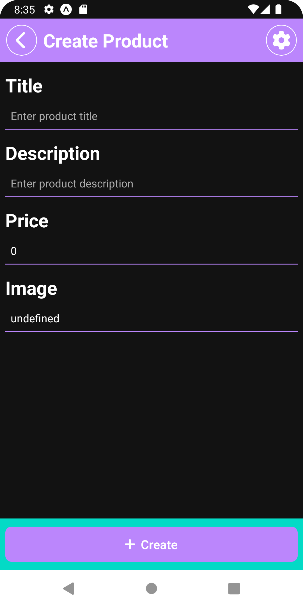
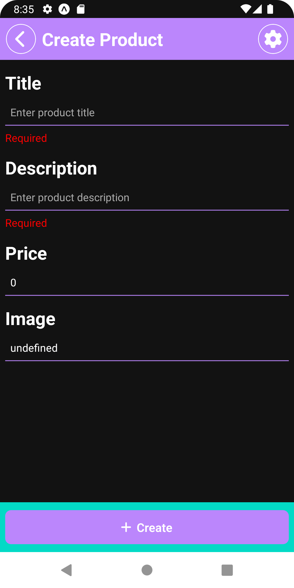
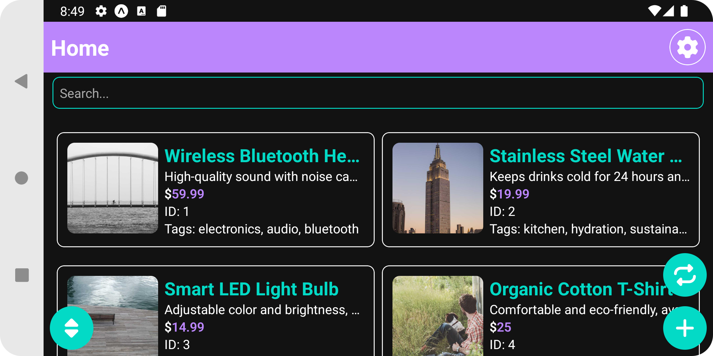

# React Native Products Manager Task:

## Requested Features:

- Displays the content from the provided array in a list format ✅
- Responsive Layout (Orientation-based): ✅
  - In portrait mode: Display items in one column. ✅
  - In landscape mode: Display items in two columns. ✅
- Sorting: ✅
  - Include a "Sort by Price" button. ✅
    - First tap: Sort items in ascending order. ✅
    - Second tap: Sort items in descending order. ✅
    - Third tap: Reset the item order. ✅
- Search: ✅
  - Add a search bar. ✅
    - Filter items in real-time by matching: ✅
    - title ✅
    - any value inside tags ✅
    - Note: The search should trigger only when a minimum of 3 letters are entered. ✅
- Multi-Select & Delete: ✅
  - Allow selecting multiple items (via checkboxes or toggles). ✅
  - Include a "Delete Selected" button to remove selected items from the list. ✅

## Additional features that I added:

- A screen for viewing product details ✅
- Ability to create a product ✅
- Ability to edit a product ✅
- App icon ✅
- Dark and light theme ✅
- Persistent storage using AsyncStorage ✅
- Ability to reset products to initial state ✅

## Screen Shots:

Home screen: dark Theme 👇

---

Ability to change theme 👇

---

Home screen: light Theme 👇

---

Ability to reset products to initial state 👇

---

Sorting and searching 👇

---

Product details screen 👇

---

Ability to delete products 👇

---

Ability to Edit Product 👇

---

Ability to Create Product 👇

---

Product Creation validation 👇

---

Horizontal mode with two columns 👇

